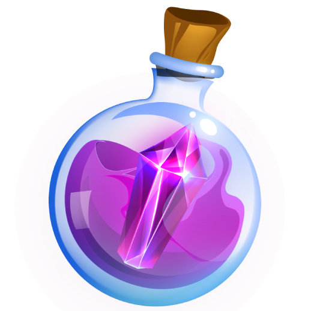

# 🧴 Rare Amethyst Elixir (RAE)

Rare Amethyst Elixir (RAE) is a reward/utility token that can be obtained by exchanging it with _Rare Amethyst Particle_ ( \[RAP] an in-game currency), you can check the exchange rate here. This can also be used to purchase weapons and heroes at the marketplace.

Please keep in mind that claiming your RAP takes two weeks. After that, you can make a claim after two weeks again.

You can sell or exchange your Rare Amethyst Elixir on decentralized exchanges and Aivuxe.

## RAE Tokenomics

| SECTION          | VALUE                |
| ---------------- | -------------------- |
| Initial Supply   | 5,000,000 RAE        |
| Max Supply       | ∞                    |
| Token Type       | Utility Token        |
| Decimals         | 18                   |
| Token Name       | Rare Amethyst Elixir |
| Ticker           | RAE                  |
| Network          | Polygon              |
| Contract Address | TBA                  |


All initial supply will be used for liquidity

