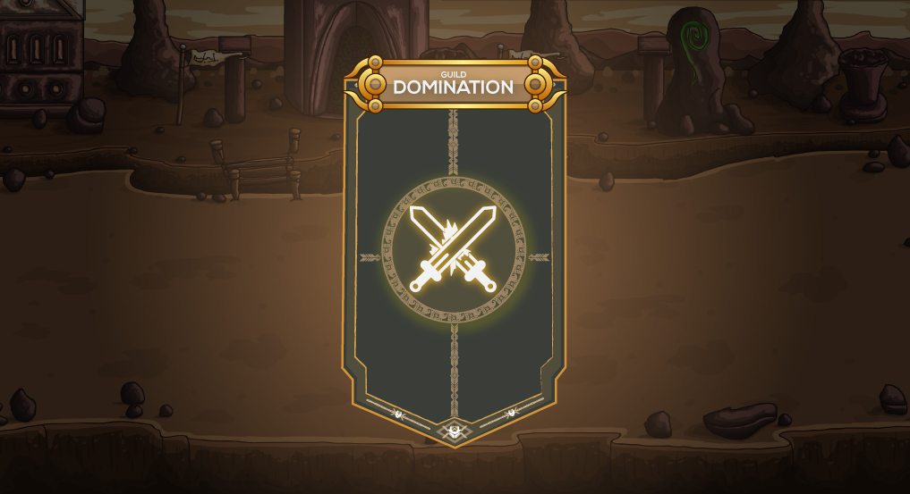

# ⚔ Guild Domination

Players can battle other Players from different guilds to represent their guild at the end of the event all wins, loses, and draws will be calculated and the victor will be decided the winning guild receives rewards as well as an increase in the overall ranking with other Guilds.


Guild Domination occurs only on the last day of the month.


## Guild Bracketing System


Each guild will be placed within a bracket then the system will randomly pick guilds within that bracket to do war with one another, Guild Domination bracket placement is based on the MMR of all the 10 representatives of the guild.


## Guild Domination Preparation


After matchmaking, a preparation period is placed for both guilds to get ready. both guilds cannot see the names and teams of the enemy guild. After the preparation time expires, the battle will proceed.

