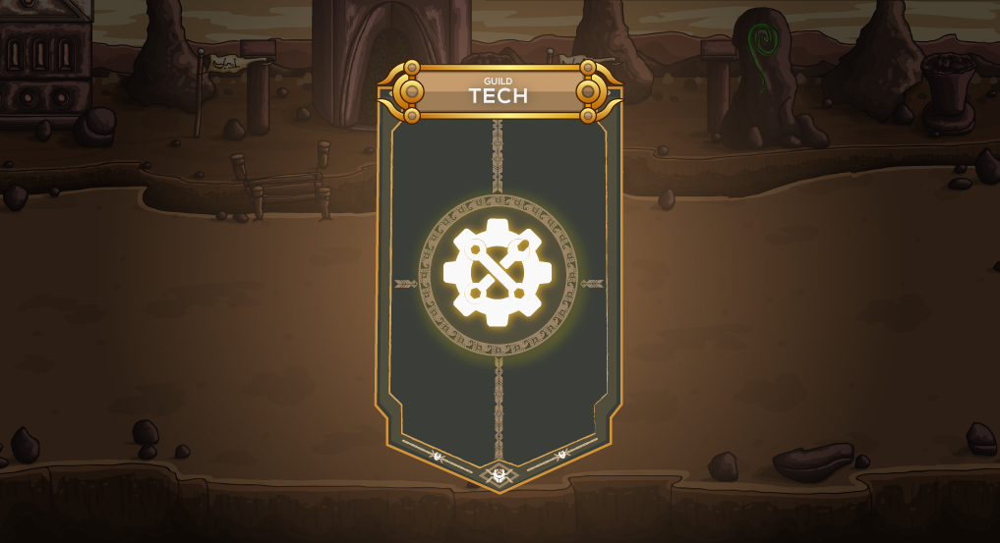

# ⚙ Guild Tech

This is where players can donate RAP(Rare Amethyst Particle) to improve the guild by increasing its level. Each level gives bonuses for everyone that is in the guild each member is only allowed to donate RAP once a day the minimum a player can donate is 2 RAP and a maximum of 10 RAP.


Perks of each Guild level


| **Level** | **Members** | **Stamina** |
| :-------: | :---------: | :---------: |
|     1     |     +10     |             |
|     2     |             |      +1     |
|     3     |      +5     |             |
|     4     |             |      +1     |
|     5     |      +5     |             |
|     6     |             |      +2     |
|     7     |     +10     |             |
|     8     |             |      +3     |
|     9     |     +10     |             |
|     10    |     +10     |      +3     |
