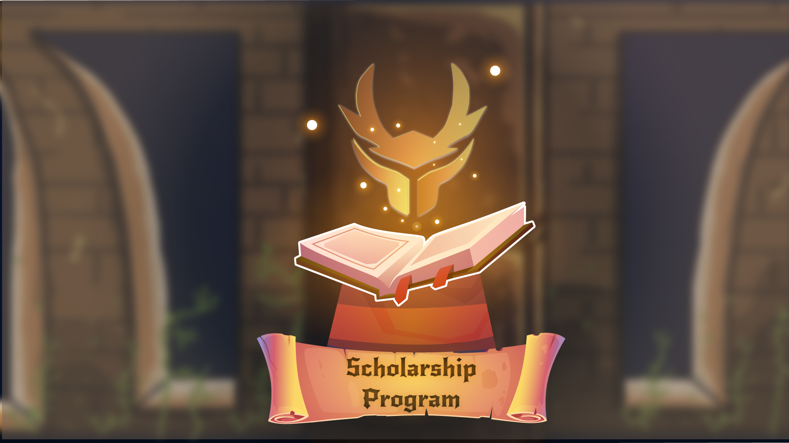

# 🏫 Scholarship Program

Just like any NFT game that has a Scholarship Program. We wish to bring fun and amusement to everyone while learning the game fundamentals, including those who do not have the resources to start and earn reward tokens from the game.

We want everyone to be able to play a game powered by blockchain technology through NFT.

So we want to introduce to you "Heroes Scrolls"

### What are Heroes Scrolls?

Scholarships were what we termed "Heroes Scrolls." Scrolls allow other players to summon other players' heroes and weapons to play the game for free.

Scrolls are divided into two categories.\
Split Scrolls and Rigid Scrolls

### What is the Split Scrolls system and how does it work?

Managers who couldn't find a scholar to play their assets and interested players who couldn't find a manager to play the game are introduced to Split Scrolls.

Split scrolls work as an intermediary for the two sides.

To begin with, managers must list their NFTs that are available for Split Scroll summoning at the Marketplace. The profit percentage split must be specified by the manager prior to listing.


e.g. 70% to the manager 30% to the players


Before playing, Players and Managers must agree on a contract.


How does the profit sharing work?

As the split scroll acts as its intermediary, all rare amethyst particles earned by the heroes called by the split scrolls will be immediately divided and automatically sent to the address each party provided.


### Rigid Scrolls

Rigid Scrolls are for managers who have surplus NFTs or assets that are just sitting in their inventory, or for managers who don't want to let go of their assets quite yet in order to trade them for anything else. Managers can profit from excess NFTs by leasing them on the market.

Managers must specify the time frame in which the NFT can be used or played with in the marketplace, as well as the leasing charge upon listing.


e.g. The team consist of 3 Earth weapon + 3 Earth Hero = 100 SGN cost for 1-week leasing


The player of the leased Assets will receive 100% of the total revenue throughout the leasing time. When the leasing period ends, the player will no longer have access to the leased Assets.
