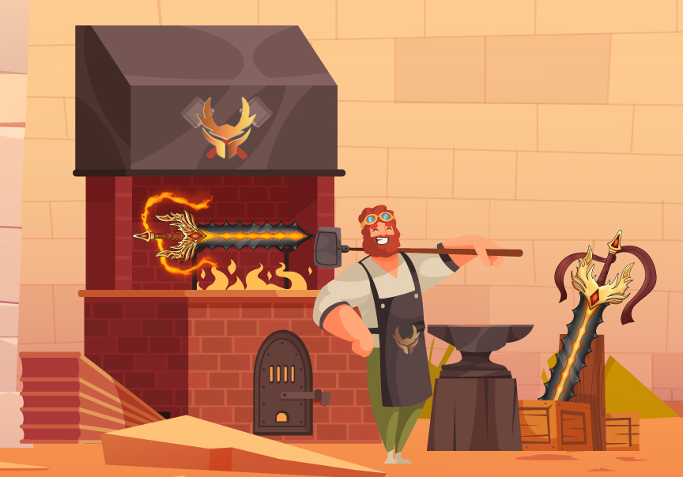

# 🔨 Forging System

If you want a better card combination, you can forge new weapons, exactly as in any other fantasy game. These weapons can be utilized in battle, used to make new weapons, or sold on the open market.


Players can only forge their weapons five times.


## Sword Parts

Sword can be varied in 4 parts and each part has its designated cards for the game. While forging these parts will be randomly passes to the forged weapon to create a new weapon and card combination within it. \
\
The category of the sword element will be determined by the blade.

## **Forging Fees**

| FORGE COUNT | Forge Number | RAE | SGN |
| ----------- | ------------ | --- | --- |
| **0/5**     | 1            | 750 | 2   |
| 1/5         | 2            | 600 | 2   |
| 2/5         | 3            | 450 | 2   |
| 3/5         | 4            | 300 | 2   |
| 4/5         | 5            | 150 | 2   |

These figures may change depending on the game's economic balance. The RAE and SGN required per forge can change.

## **Genetics**

Swords have 4 parts, each part possesses 4 genes. A dominant (D), major recessive (R1), minor recessive (R2), and hidden recessive gene (R3). The idea comes from a well-known game called Axie Infinity, and Cryptokitties


The dominant gene is what determines the part that is physically present on the Sword. When forging, each gene has a chance to be passed down to the forged weapon:


* **Dominant (D):** 60% chance to pass this gene to the forged weapon.
* **Major Recessive (R1):** 24.125% chance to pass this gene to the forged weapon.
* **Minor Recessive (R2):** 12.135% chance to pass this gene to the forged weapon.
* **Hidden Recessive (R3):** 3.74% chance to pass this gene to the forged weapon

## Element Calculation

Each forged weapon has a 50% chance of inheriting each of the weapons element used in forging. So if you pair two different elements then you have a 50% on producing the other and 50% on producing the other weapons element. If you pair both of the same elements, the forged weapon is guaranteed that element.

## Collab Forging

We are pleased to announce that we will have a collaboration forging for those who don't have the capacity to cater to forge.

Players will list their available pair on the marketplace and wait for the other player to complete and meet the requirement needed to forge.

> _They will split in half of the forged weapons._\
> \
> _The minimum times to forge are incremented by two._


_e.g._\
\_\_\
_A player list a collab pair on the market which has 0/5 and 0/5 forge count that will be forged four times. The other player will gather the requirements needed to forge those collab pairs. Then after gathering the required amount of RAE and SGN, and completing forging they will split all the forged weapons in half. Having each player two forged weapons._


## Cooldown Times

We invoke a cooldown time for gifting, forging, and smelting.

### Gifting

Swords gifted under 48 hours will no longer gain rewards from any battle.

> _Having one sword gifted will trigger the above consequence._

### Forging - The waiting time that can be forge again

We have a forging cooldown to balance the growth of swords.

> _Every forge count will increase 12 hours of the forging cooldown._

| FORGE COUNT | COOLDOWN (HRS) |
| ----------- | -------------- |
| 0/5         | 12             |
| 1/5         | 24             |
| 2/5         | 36             |
| 3/5         | 48             |
| 4/5         | 60             |

### Smelting - The waiting time that the sword is forged

We have smelting time depending on the forge count of the parent. Below is the smelting time per forge count.

> _Every forge count will increase 24 hours of the waiting time to be forged._

| FORGE COUNT | SMELTING TIME (HRS) |
| ----------- | ------------------- |
| 0/5         | 48                  |
| 1/5         | 72                  |
| 2/5         | 96                  |
| 3/5         | 120                 |
| 4/5         | 144                 |


e.g.

\
The Player will forge two swords with 4/5 and 1/5 forge count. The two swords' smelting time will be added.\
\
4/5 = 144 HRS\
1/5 = 72 HRS\
\
So the player will wait for 216 HOURS of smelting time for the forged weapon to be forged.

