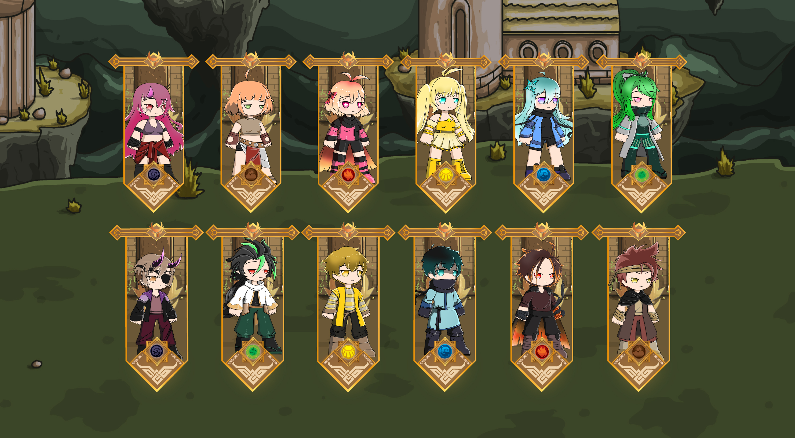

# 🧙 Heroes

Heroes are summoned by players to assist them in their journey through the land of Mydoslyne. These summoned heroes will aid you in your quest, but each element has its own set of strengths and weaknesses, so choose your hero wisely and build your team to your liking.


You can get your Heroes by minting or purchasing one on the marketplace.


## Minting Heroes

Minting a hero does not guarantee you your desired Hero, it will be generated randomly. You can't decide what element and gender it will generate once you mint a hero. You can use RAP to mint heroes.


_"Minting requirements may change depending on the game's economic balance."_

