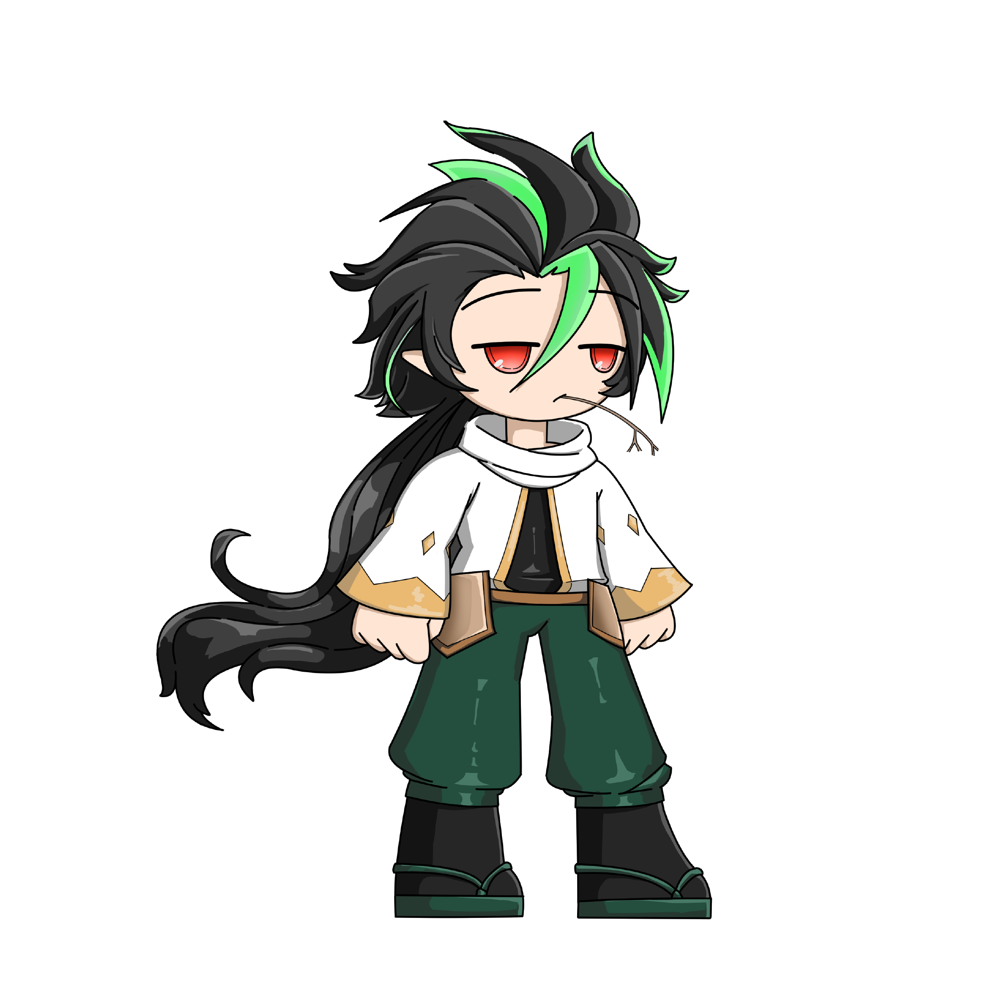
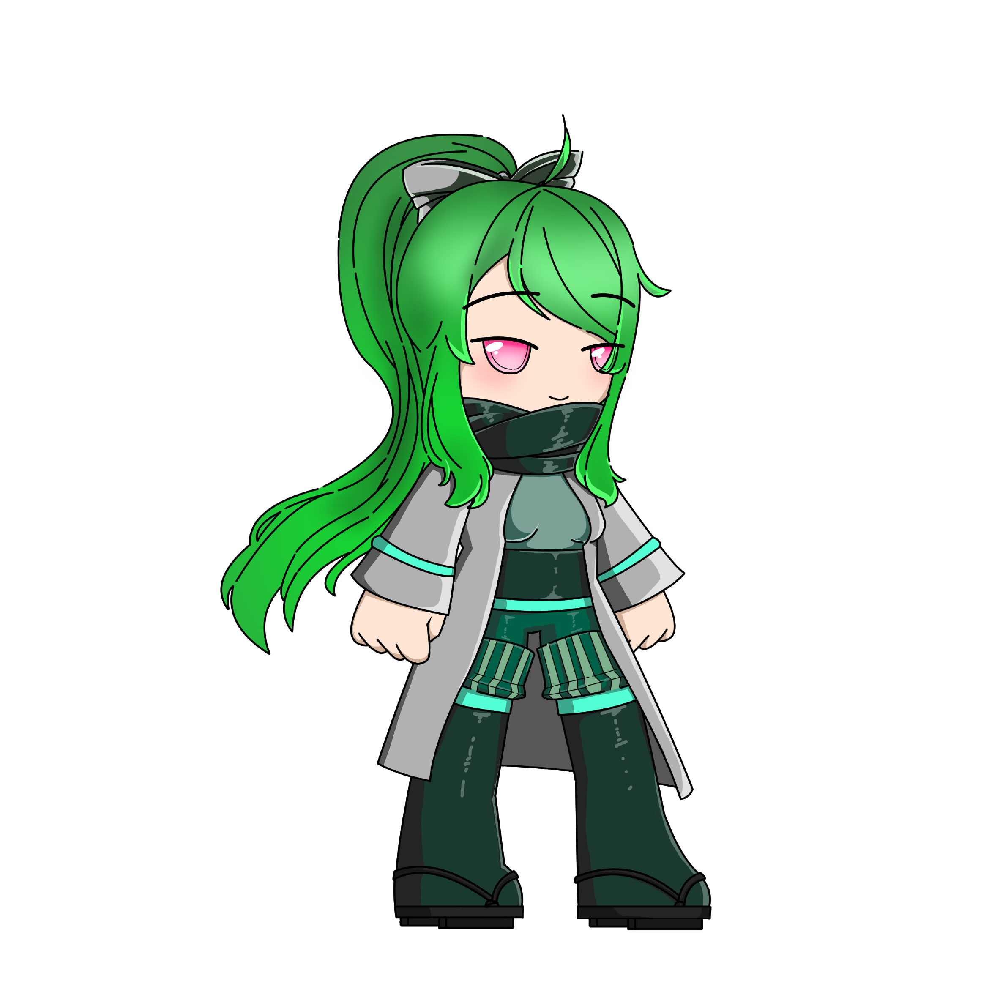

# 🌬 Air element

### Zephyr

<figure><figcaption></figcaption></figure>

Rarely seen by anyone due to his unmatched speed, fights with Zephyr rarely last few seconds as enemies go down before even realizing what has hit them

### Misha

<figure><figcaption></figcaption></figure>

Described by people who encountered her as a soft gentle breeze, Misha fights enemies with quick calculated cuts that render foes weak.
