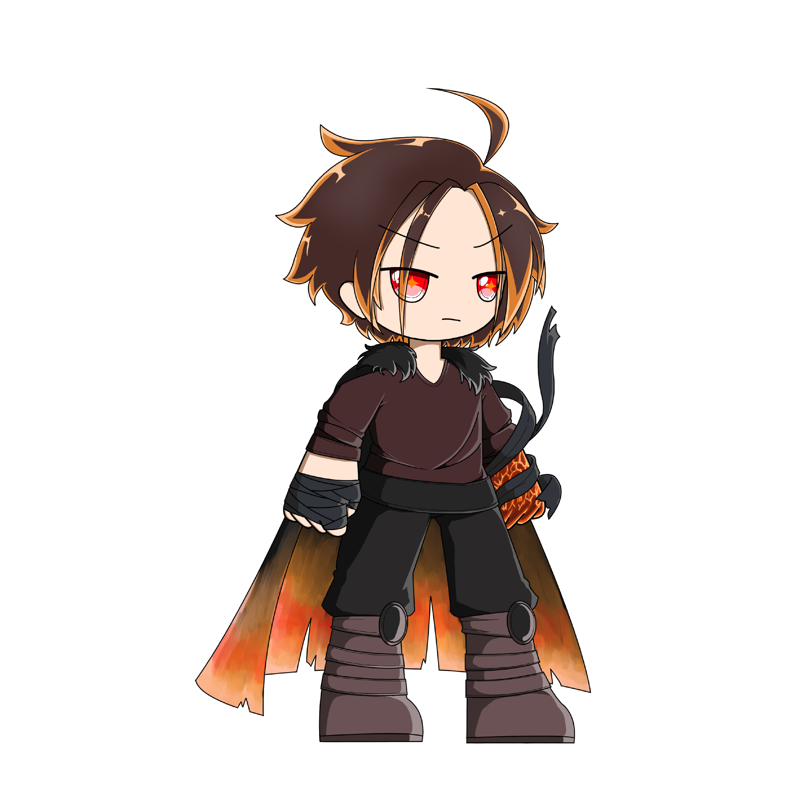
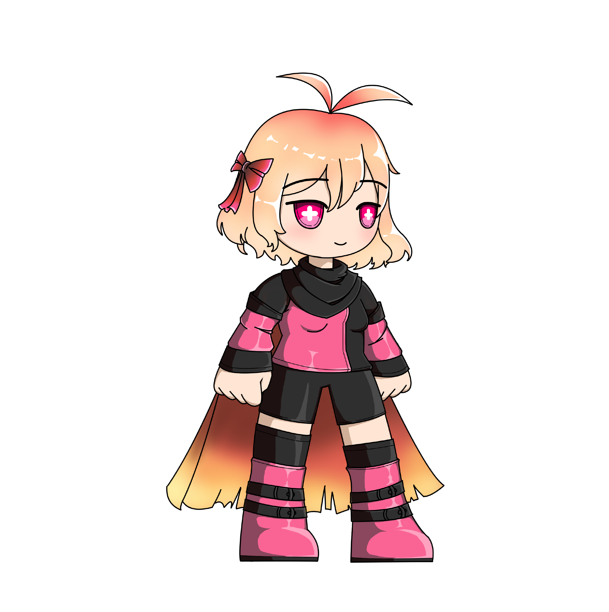

# 🔥 Fire element

### **Aidan**

<table data-view="cards"><thead><tr><th></th><th></th><th data-hidden data-card-cover data-type="files"></th></tr></thead><tbody><tr><td>sadasd</td><td>sdadsadadasdas</td><td><a href="../../../.gitbook/assets/GIT-4-test.png">GIT-4-test.png</a></td></tr><tr><td></td><td></td><td><a href="../../../.gitbook/assets/GIT-4-test.png">GIT-4-test.png</a></td></tr><tr><td></td><td></td><td><a href="../../../.gitbook/assets/GIT-4-test.png">GIT-4-test.png</a></td></tr></tbody></table>

<figure><figcaption></figcaption></figure>

***

Holds a destructive element that destroys anything in its way, Aidan has mastered this element to eliminate demons and return the world to what it once was.

### Liayra

<figure><figcaption></figcaption></figure>

Blazing through the battlefield with a fiery resolve, Liayra decimates enemies left and right, choosing to attack first and then wait for a plan.
