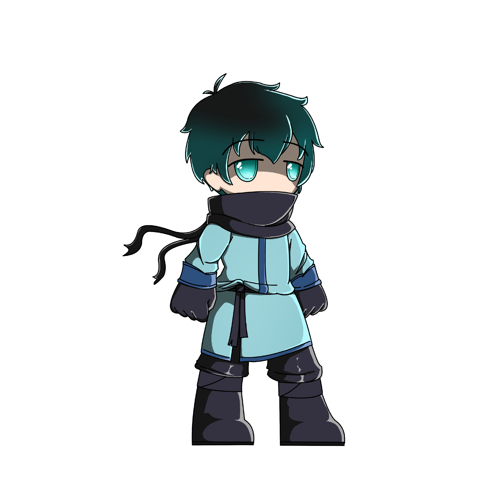
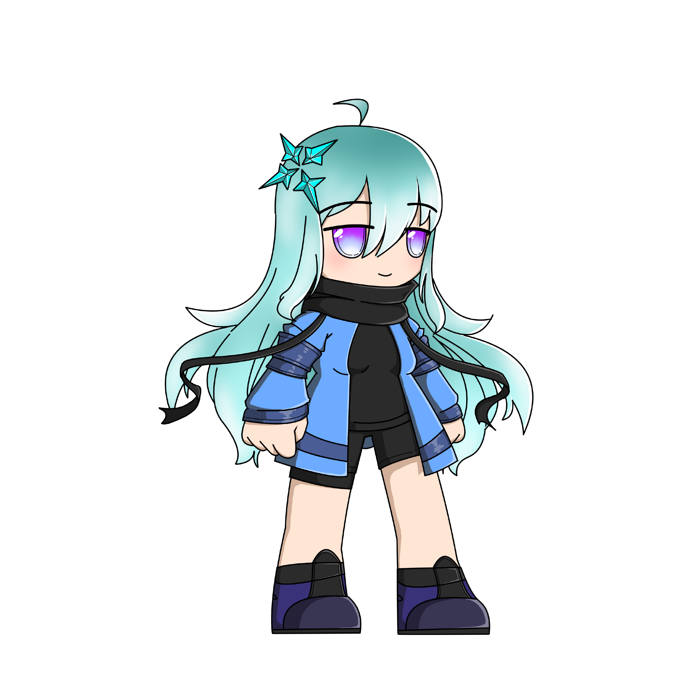

# 🌊 Water element

### Flyse

<figure><figcaption></figcaption></figure>

Flyse rarely takes action, opting to just watch from the sideline, but when the waters he vowed to protect are threatened, his wrath is not far behind.

### Oshal

<figure><figcaption></figcaption></figure>

Compassionate and calm. Oshal is always right beside her friends. She may seem harmless, but she will not hesitate to put down anyone that hurts her friends.
